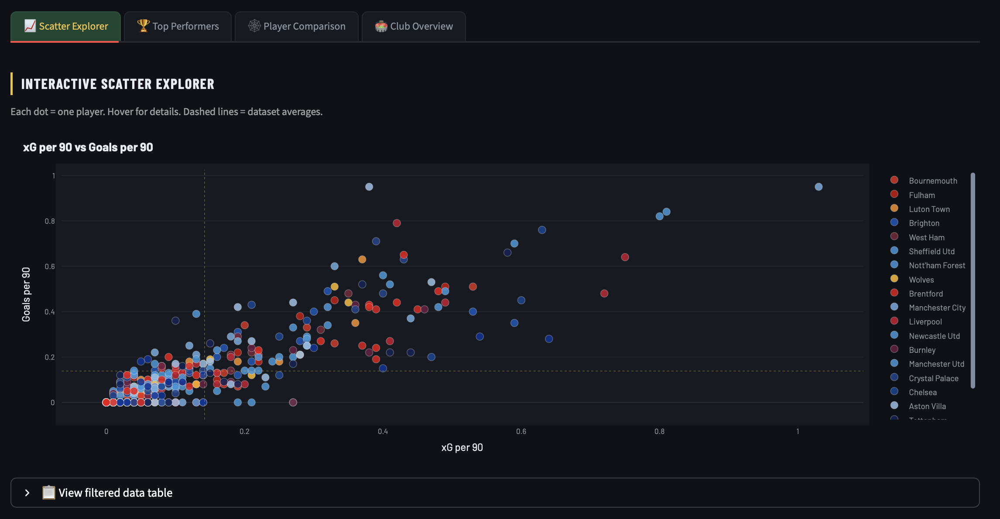
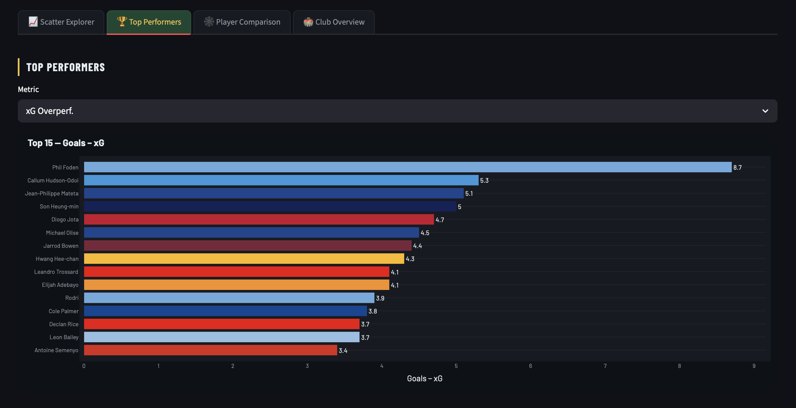
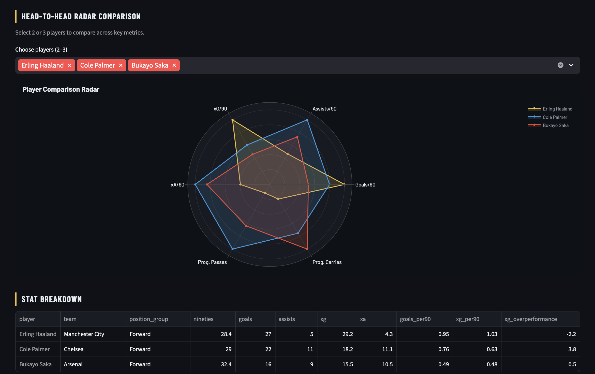
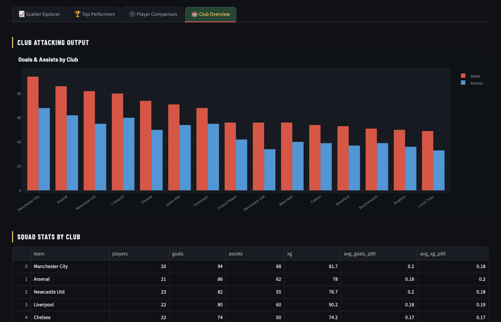

# ⚽ Premier League Player Performance Dashboard

> An interactive analytics dashboard for exploring Premier League 2023/24 player statistics — built with Streamlit, Plotly, and real match data.


---

## What This Dashboard Does

This tool allows scouts, analysts, and football enthusiasts to:

- **Compare players** across attacking, creative, and progressive metrics
- **Identify overperformers** using xG vs actual goals analysis
- **Explore club-level output** and squad contribution breakdowns
- **Build custom scatter plots** across any two metrics in real time

---

## Screenshots






---

## Run Locally

```bash
# 1. Clone the repo
git clone https://github.com/FU77META7/pl-analytics-dashboard.git
cd pl-analytics-dashboard

# 2. Install dependencies
pip install -r requirements.txt

# 3. Download the dataset
```

Download the **Top 5 European Leagues 2023/24 Player Stats** dataset from Kaggle:
👉 https://www.kaggle.com/datasets/orkunaktas/all-football-players-stats-in-top-5-leagues-2324

Place the downloaded `top5-players.csv` file inside the `data/` folder, then run:

```bash
# 4. Convert the dataset to dashboard format
python fetch_data.py

# 5. Launch the dashboard
streamlit run app.py
```

The app also ships with a **built-in sample dataset of 24 real PL 2023/24 players** — if no CSV is found it falls back to this automatically so you can preview the dashboard immediately.

---

## 📁 Project Structure

```
pl-analytics-dashboard/
│
├── app.py                  # Main Streamlit application
├── fetch_data.py           # Converts Kaggle CSV to dashboard schema
├── requirements.txt
│
├── utils/
│   ├── data_loader.py      # Data loading, cleaning & feature engineering
│   └── charts.py           # All Plotly visualisation functions
│
└── data/
    └── pl_standard.csv     # Generated by fetch_data.py 
```

---

## Features

### Tab 1 — Scatter Explorer
Interactive scatter plot with any two metrics on X/Y axes. Coloured by club, with average lines and full hover tooltips. Great for spotting outliers and hidden gems.

### Tab 2 — Top Performers
Horizontal bar chart ranking the top 15 players by any selected metric. Includes an xG vs Actual Goals plot highlighting over/underperformers.

### Tab 3 — Radar Comparison
Spider/radar chart comparing up to 3 players across 6 key metrics, normalised for fair comparison. Includes a stat breakdown table underneath.

### Tab 4 — Club Overview
Club-level goals & assists breakdown, plus a full squad aggregation table with average per-90 rates.

---

## Tech Stack

| Tool | Purpose |
|---|---|
| `streamlit` | Dashboard framework |
| `plotly` | Interactive charts |
| `pandas` | Data wrangling & feature engineering |
| `numpy` | Numerical computations |

---

## Methodology

- All per-90 metrics normalised by `90s played` (minimum 3 x 90s filter applied)
- xG overperformance = `Goals − xG` (positive = finishing above expectation)
- Dashboard shows 1,184 player-attributed goals vs the official 1,246 total — the difference (~49) is own goals which are not attributed to any player in statistical databases, plus ~13 goals from players filtered out by the minimum appearances threshold
- Club colours sourced from official Premier League brand guidelines
- Data sourced from **FBref** (via Kaggle) — the industry standard used by clubs and journalists

---

## Future Improvements

- [ ] Add defensive metrics (tackles, interceptions, pressures)
- [ ] Season-over-season comparison (2022/23 vs 2023/24)
- [ ] Player similarity finder using cosine similarity
- [ ] Export filtered data as CSV

---

## Author

**Aditya Gaisamudre**  
MSc Data Science — King's College London  
[LinkedIn](https://linkedin.com/in/aditya-gaisamudre) · [GitHub](https://github.com/FU77META7)

---

*Data sourced from FBref via Kaggle · Built for portfolio purposes · Not affiliated with the Premier League*
